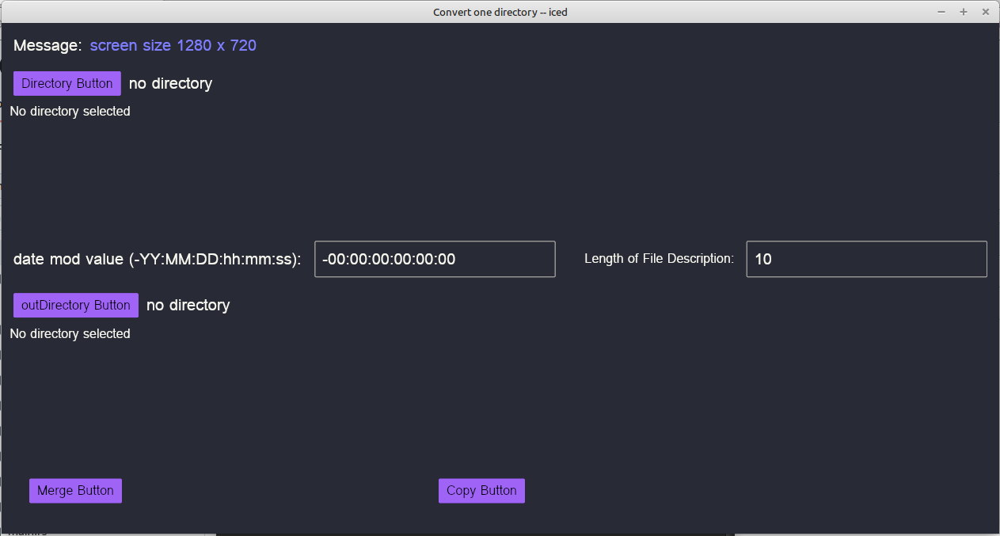

# convertonedir
Rust-Iced program to create a merge folder of images from another folder.

This program calls winitsize01 to get the smallest monitor size.

Iced is still being developed and the use of progress bar is very hard to implement.

