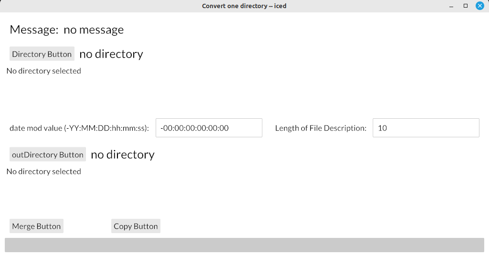

# convertonedir
Rust-Iced program to create a merge folder from another folder

I converted one function in photoomc04 from using gtk4 to iced. Iced is still being developed and the use of progress bar is very hard to implement. Also the merge function in photoomc04 cannot be implemented until the select option, image display and other factors are incorporated into iced.

